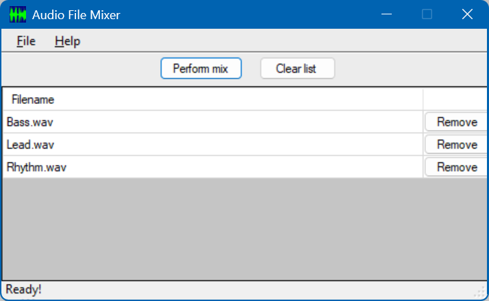

# Audio Mixer (C#)
One of my interests and hobbies is music.  For this project, I created a C# class that could be used to
open, read, and write WAV audio files. My WAVFile class supports 8- and 16-bit audio, mono or stereo.
One of its special features is a method that will mix WAV audio files together, so that the audio from
each source WAV file will be heard simultaneously. Any number of WAV files can be mixed together. The
only restriction is that they all need to have the same sample rate. Otherwise, the WAV files can be
either mono or stereo and contain 8- or 16-bit audio.

All audio handling and mixing is done within the WAVFile class, and no external libraries are required.

I wrote this in 2009; I've gained more experience since then, and if written in more modern C#,
this could potentially be done differently and better.

I originally used Visual Studio 2008 to build this (I used the free Community edition).

Visual Studio can be downloaded
<a href='https://visualstudio.microsoft.com/vs/older-downloads/' target='_blank'>here</a>.
As of this writing (January 3, 2026), that page has versions of Visual Studio from 2015 to 2022.

## Included Application
The following is a screenshot of the application:

<p align="center">
  
</p>


To add WAV files to the list, you can drag & drop files onto the GUI, or choose File > Add Audio File(s).

## Prerequisites
The compiled application requires version 3.5 of the .NET runtime. The code provided was created with Visual
C# 2008; earlier versions of Visual C# may not be able to open or compile the code.

## Background
A WAV audio file consists of a header at the beginning of the file, which contains strings to identify the
file type ("RIFF" and "WAVE"), as well as information about the audio contained in the file (number of
channels, sample rate, number of bits per channel, size of the data, etc.). Following the header is all of
the audio data. Digital audio data is numeric: each sample is an integer that represents the level of the
audio signal at that point in time.

One of the issues that needs to be dealt with when mixing audio (and dealing with audio in general) is
audio clipping. Digital audio clipping is caused by numeric range limitations of the sample size (8 or 16
bits): when audio samples are manipulated (i.e., if the volume is increased), it's possible for the
resulting values to go beyond the numeric range. When that happens, the result (often loud) pops and clicks
in the audio, which is undesirable. So, in order to mix WAV files together, MergeAudioFiles() in my WAVFile
class will first analyze each audio file to determine the highest audio sample, then reduce the volume in
all of the audio files, copying them to a temporary directory. The audio volume is reduced enough so that
when the audio samples are added together during the mixing, the numeric range of the data will not be
exceeded. After mixing, the volume of the final mix file is increased back up to an acceptable level. The
mixing process can take over a minute or two in some cases, which is normal.

Wikipedia has <a href='https://en.wikipedia.org/wiki/Clipping_(audio)' target='_blank'>an article on
audio clipping</a> that describes it in more detail.

## Using the Code
The WAVFile class would be a useful class for reading and writing WAV audio files. The class can open,
read, and write WAV audio. The following are some of the most important methods (note that they all will
throw an exception for a serious or potentially serious error):

string Open(String pFilename, WAVFileMode pMode): Opens an existing WAV file. Returns a string, which
will be blank upon success, and upon error, will contain the reason it failed. This method will throw
an exception for a more serious error.

| Method                                                                                              | Description                                                                                                                                                                                                                |
| --------------------------------------------------------------------------------------------------- | -------------------------------------------------------------------------------------------------------------------------------------------------------------------------------------------------------------------------- |
| void Create(String pFilename, bool pStereo, int pSampleRate, short pBitsPerSample, bool pOverwrite) | Creates a new WAV file.                                                                                                                                                                                                    |
| byte[] GetNextSample_ByteArray()                                                                    | When in read or read/write mode, this returns the next sample as a byte array, which will contain one byte for 8-bit audio or 2 bytes for 16-bit audio.                                                                    |
| byte GetNextSample_8bit()                                                                           | This is a convenience method that returns the next audio sample as a byte (8 bits). This is only valid when dealing with 8-bit audio.                                                                                      |
| short GetNextSample_16bit()                                                                         | This is a convenience method that returns the next audio sample as a short (16 bits). This is only valid when dealing with 16-bit audio.                                                                                   |
| short GetNextSampleAs16Bit()                                                                        | Similar to the above method, except that it will always return a 16-bit value, regardless of whether the audio is 8-bit or 16-bit. Additionally, if the audio is 8-bit, the value will be scaled to 16 bits. For example, if the audio is 8-bit, a value that is 50% of the maximum will still be 50% of the maximum after being scaled to a 16-bit value. |
| byte GetNextSampleAs8Bit()                                                                          | Similar to the above method, this will always return the next sample as an 8-bit value, regardless of whether the audio is 8-bit or 16-bit, and 16-bit values will be scaled down to 8 bits.                               |
| void AddSample_ByteArray(byte[] pSample)                                                            | When in write or read/write mode, this adds an audio sample to the WAV file. It takes a byte array as a parameter; the array would need to contain one byte for 8-bit audio or 2 bytes for 16-bit audio.                   |
| void AddSample_8bit(byte pSample)                                                                   | A convenience method to add an 8-bit value to a WAV file. The WAV file must contain 8-bit audio.                                                                                                                           |
| void AddSample_16bit(short pSample)                                                                 | A convenience method to add a 16-bit value to a WAV file. The WAV file must contain 16-bit audio.                                                                                                                          |
| void Close()                                                                                        | Closes the audio file.                                                                                                                                                                                                     |

The following are some of the extra utility functions (these are all static):

| Method                                                                                             | Description                                                                                              |
| -------------------------------------------------------------------------------------------------- | -------------------------------------------------------------------------------------------------------- |
| void MergeAudioFiles(String[] pFileList, String pOutputFilename, String pTempDir)                  | Merges audio files. This method is static.                                                               |
| void AdjustVolume_Copy(String pSrcFilename, String pDestFilename, double pMultiplier)              | Adjusts the volume of a WAV file, copying it to a new file.                                              |
| void AdjustVolumeInPlace(String pFilename, double pMultiplier)                                     | Adjusts the volume of a WAV file (alters the original file).                                             |
| void AdjustVolume_Copy_8BitTo16Bit(String pSrcFilename, String pDestFilename, double pMultiplier)  | Adjusts the volume of a WAV file and converts 8-bit samples to 16-bit samples, copying it to a new file. |
| void Convert_8BitTo16Bit_Copy(String pSrcFilename, String pDestFilename)                           | Converts an 8-bit WAV file to a 16-bit WAV file, copying it to a new file.                               |
| void CopyAndConvert(String pSrcFilename, String pDestFilename, short pBitsPerSample, bool pStereo) | Copies a WAV file to a new file, altering the number of bits per sample and/or the number of channels.   |

These are some of the (read-only) properties that are available:

| Property            | Description                                                                        |
| ------------------- | ---------------------------------------------------------------------------------- |
| SampleRateHz        | The audio sample rate (in Hz).                                                     |
| BitsPerSample       | The number of bits per sample (i.e., 8 or 16).                                     |
| NumChannels         | The number of audio channels: 1 (mono) or 2 (stereo).                              |
| IsStereo            | Boolean: Whether or not the audio is stereo (has 2 channels).                      |
| NumSamples          | The number of audio samples.                                                       |
| NumSamplesRemaining | The number of audio samples remaining (when reading through an existing WAV file). |

An example of opening a WAV file and looping through to get each audio sample (assuming the audio file contains
16-bit audio):

```C#
WAVFile audioFile = new WAVFile();
String warning = audioFile.Open("someAudioFile.wav", WAVFile.WAVFileMode.READ);
if (warning == "")
{
   short audioSample = 0;
   for (int sampleNum = 0; sampleNum < audioFile.NumSamples; ++sampleNum)
   {
      audioSample = audioFile.GetNextSampleAs16Bit();
   }
}
```

The MergeAudioFiles() method is static, so you don't need a WAVFile instance in order to call it. Its parameters
are an array of strings (the source WAV file names), the destination file name, and a directory that can be used
as a temporary directory. For example:

```C#
// Create an array of filenames for the WAVFile class
String[] audioFilenames = new String[3];
audioFilenames[0] = "SourceFile1.wav";
audioFilenames[1] = "SourceFile2.wav";
audioFilenames[2] = "SourceFile3.wav";
// Mix the audio files together into Output.wav
WAVFile.MergeAudioFiles(audioFilenames, "Output.wav", "C:\\Temp");
```

## Exceptions
The following exceptions (declared in WAVFileExceptions.cs) are thrown by the WAVFile class:

| Exception                     | Description                                                                                                                                             |
| ----------------------------- | ------------------------------------------------------------------------------------------------------------------------------------------------------- |
| WAVFileReadException          | Thrown when there is a problem reading a WAV file                                                                                                       |
| WAVFileWriteException         | Thrown when there is a problem writing to a WAV file                                                                                                    |
| WAVFileBitsPerSampleException | Thrown when an unsupported number of bits per sample is encountered. The BitsPerSample property will contain the bits per sample value that is invalid. |
| WAVFileSampleRateException    | Thrown when an unsupported sample rate is encountered. The SampleRate property will contain the sample rate that is invalid.                            |
| WAVFileAudioMergeException    | Thrown by WAVFile.MergeAudioFiles() when there is a problem mixing WAV files.                                                                           |
| WAVFileIOException            | Thrown when there is a general I/O problem.                                                                                                             |
| WAVFileException              | Thrown when there is a general/unclassified problem.                                                                                                    |

In addition to the Message property provided by the exception classes, these exception classes provide another
property, ThrowingMethodName, which is a string containing the name of the method that threw the exception.

## Points of Interest
One interesting thing to note is that data in a WAV audio file is always little-endian, per the specification. On
big-endian systems, the byte order must be reversed before manipulating the audio data, and the byte order for a
sample must be reversed before saving it to a WAV file. My WAVFile class handles this automatically; for example,
if the system is big-endian, then when retrieving audio samples from a WAV file using GetNextSample_16bit() or
adding a 16-bit sample to a WAV file using AddSample_16bit(), the bye order will be automatically reversed so that
the data is in the proper order.

In creating the WAVFile class, it was necessary to look up the WAV file format specification. I found many web
pages describing the WAV file format. Each page has basically the same information, but with different notes. I
found the following four pages useful:

## Points of Interest
One interesting thing to note is that data in a WAV audio file is always little-endian, per
the specification. On big-endian systems, the byte order must be reversed before manipulating
the audio data, and the byte order for a sample must be reversed before saving it to a WAV
file. My WAVFile class handles this automatically; for example, if the system is big-endian,
then when retrieving audio samples from a WAV file or adding a 16-bit sample to a WAV file,
the bye order will be automatically reversed so that the data is in the proper order.

In creating the WAVFile class, it was necessary to look up the WAV file format specification.
I found many web pages describing the WAV file format. There were 4 URLs I had referenced
when I originally wrote this, but only one still exists today:
<ul>
<li><a href='http://www.ringthis.com/dev/wave_format.htm' target='_blank'>http://www.ringthis.com/dev/wave_format.htm'_blank</a>
</ul>

I also have <a href='https://github.com/EricOulashin/audio_mixer_cpp' target='_blank'>a C++ version of this</a> which I originally wrote in December 2018.

I originally posted this project <a href='https://codeproject.com/articles/C-WAV-file-class-audio-mixing-and-some-light-audio' target='_blank'>on CodeProject</a>.
